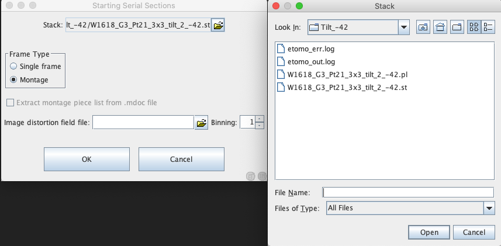
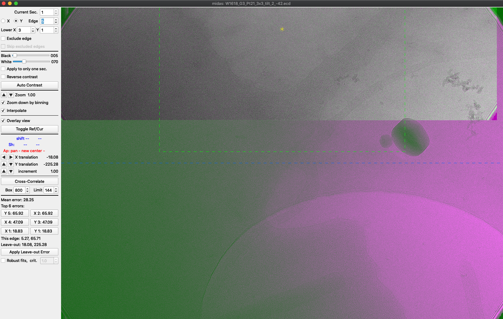
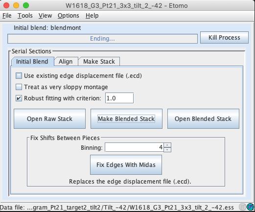

## Generate stitched montage and individual tilt series

### Requirement

Your environment will need to have Python 3 installed and in the system PATH.

You also need an installation of IMOD 4.11.6 or higher to provide the tools for assembling stacks and blending images.

Batch motion correction pre-processing can use `alignframes` provided by IMOD, or use the UCSF `motioncor2` for GPU accelerated motion correction.


### Run Python scripts to get started

Navigate to the latest package containing Python scripts and follow the steps to generate stitched montage tilt series and individual tile tilt series.

### Stitching adjustment when needed

Check the end output .st file from `BlendStitch.py` with bin of 4 and see from which tilt angle stitching starts to look bad. The workflow implements `midas` in IMOD to manually align misblended montage tiles.

Note: the output .st file is reordered from the end tilt angle to start tilt angle specified in the `cryoMontage.txt` macro. 
At the end of `BlendStitch.py` run, you should see a folder with the Basename_Processing and a text file that contains the tilt angle corresponding to each section per line.

Alternatively, you could run `extracttilts` (IMOD command) 

```
extracttilts W1618_G3_Pt21_3x3_tilt_2_AliSB_bin4.st W1618_G3_Pt21_3x3_tilt_2_AliSB_bin4.tlt \
cat -n W1618_G3_Pt21_3x3_tilt_2_AliSB_bin4.tlt \

```
After identifying tilt sections that require manually stitching, go to that tilt folder and start the **Etomo** interface:

```
cd Tilt_-42 \
etomo \
```

Select *Align Serial Sections / Blend Montages* in the Etomo Front Page window.



Click *Fix Edges With Midas*.

<!--- Insert MIDAS GUI2 -->


Note: Parameters in the MIDAS GUI window to help the manual alignment include 
- Binning - set to 4 to increase the contrast and also reduce the size
- Box size under *Cross-Correlate* to include larger field of view
- Save the transformation before exitting out the program under *File* and if *Save Transformation*
- Robust fitting with criterion 1.0 - set to increase the robustness 

<!--- Insert MIDAS GUI3 and GUI5, no need for GUI4 if too many-->





Select `W1618_G3_Pt21_3x3_tilt_2_-42.st` as an input stack, and set the `Frame Type` as *Montage* and click *OK* to move on.

Once you are happy with the stitching by check the re-stitched tilt frame (_preblend.mrc_), rename and copy the frame to the upper folder by running the commands 

```
mv W1618_G3_Pt21_3x3_tilt_2_-42_preblend.st Tilt_-42.st \
mv Tilt_-42.st ../ \
cd ../ 
```
After fixing all misblended tilt sections, generate a new fully stitched stack by initiating `newstack` in IMOD 

```
newstack -tilt tilt.rawtlt -fileinlist tiltlist.txt -ou W1618_G3_Pt21_3x3_tilt_2_AliSB_reblend.st 
```
You can bin the stack to 2 or 4 by running the commands
```
newstack -shrink 2.0 W1618_G3_Pt21_3x3_tilt_2_AliSB_reblend.st W1618_G3_Pt21_3x3_tilt_2_AliSB_reblend_bin2.st \
newstack -shrink 4.0 W1618_G3_Pt21_3x3_tilt_2_AliSB_reblend.st W1618_G3_Pt21_3x3_tilt_2_AliSB_reblend_bin4.st
```

The end output can then be further processed to generate a stitched montage tomogram.
