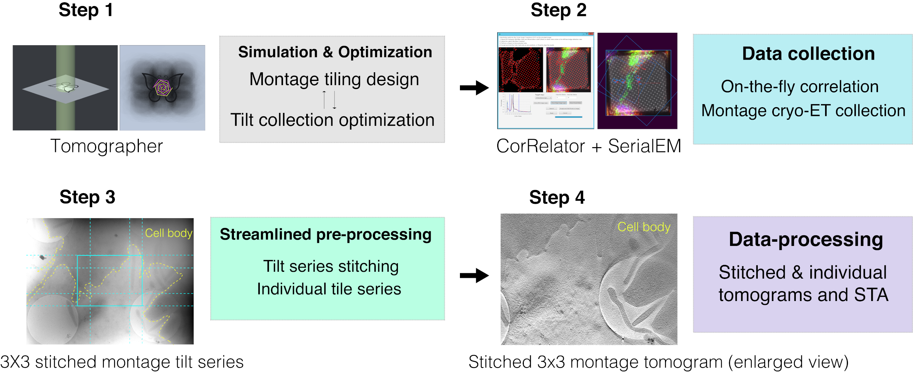

# CryoET Montage
---

This repository provides resources for the montage tomography with SerialEM.

## Instructions for Software 

1. SerialEM macro documentation to setup a montage tomography data collection.

	[Documentation for SerialEM data collections](SerialEM/README.md)
	

2. TomoGrapher, a tomography simulation program for pre-planning the data collections.

	[TomoGrapher documentation](TomoGrapher/README.md)

3. Python scripts for stitching images and building stacks for tomograms.

	[Python scripts for preprocessing of the tilt series](Python/README.md)

4. Guide for making adjustments to stitching with Etomo and Midas.

	[Improving stitching in Etomo with Midas](Midas/README.md)

### Tutorial

Walkthrough in a tutorial with a provided sample dataset collection of a 3x3 montage in the [Tutorial on Montage Creation](Tutorial/README.md)

## References

**Correlative cryogenic montage electron tomography for comprehensive in-situ whole-cell structural studies.** Jie E Yang, Matthew R Larson, Bryan S Sibert, Joseph Y Kim, Daniel Parrell, Juan C Sanchez, Victoria Pappas, Anil Kumar, Kai Cai, Keith J Thompson, Elizabeth R Wright.

bioRxiv 2021.12.31.474669; doi: [https://doi.org/10.1101/2021.12.31.474669](https://doi.org/10.1101/2021.12.31.474669)
