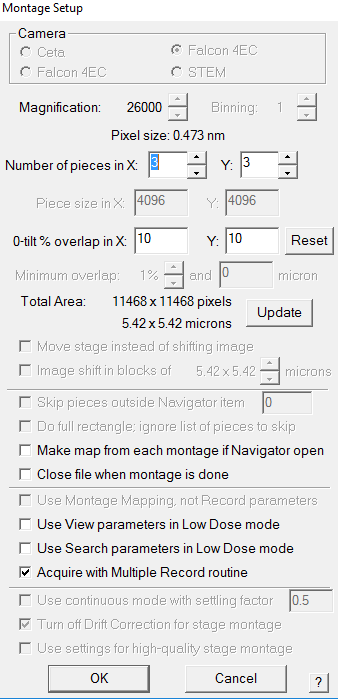
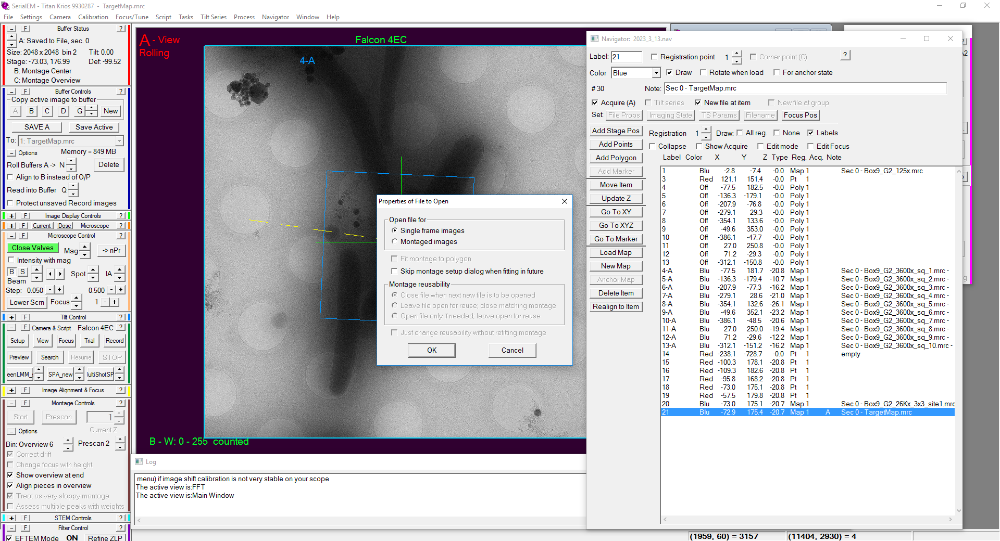

## SerialEM Setup for Montage Parrallel Array Cryo-Tomography (MPACT)

This workflow uses Open-source microscope control software SerialEM to implement dose distribution and montage cryo-electron tomography for acquisition of large field of view without sacrificing high resolution information.

### Features

- Flexibility. The current tools support rectangle or square montage tiling pattern. Users can specify the tile piece numbers based on their applications

- Outputs. The acquired montage tilt series can be stitched together to be used as as one whole unit or sorted into individual tiles to be used as regular tomograms. One 3x3 montage tilt series could yield 10 usable tilt series (9 individual tiles and 1 fully stitched tilt series) 

- Acquisition. This workflow uses the built-in SerialEM function, *Multiple Record* with image shift, to achieve accurate image-shift based montage pattern collection. Thus, all settings and functions related to *Multiple Record* are applicable here to design user-specified patterns, correct coma introduced by beam tilt, etc.

### Requirements

MPACT has been tested on a Thermo Fisher Scientific Krios G3i and G4 transmission electron microscope eqquipped with K3 or Falcon 4i direct electron dector. In principal, MPACT should be applicable to all autoloader-equipped microscopes with stable beam-image shift lens system.

MPACT is applicable to both SerialEM 3.8 above and 4.0 stable release, and 4.1. The Python scripting capacity is not required. 

To use MPACT, copy the content of *SerialEM cryoMontage macro 3.8 above* (if SerialEM 3.8 and above, 4.0 stable release is installed) or *SerialEM cryoMontage macro 4.1* (if SerialEM 4.1 is installed) in an empty SerialEM script slot/window.

### Microscope imaging set up

In general, there are two ways to define MPACT parameters (rectangular or square size of the field of view, image shift, tile overlay), depending on which SerialEM (stable release or 4.1) is currently installed. 

**1.** The image shift and pixel size at the recording magnification should be well calibrated and up to date in SerialEM, follow the instructions [Calibrate Image Shift and Pixel Size](https://bio3d.colorado.edu/SerialEM/hlp/html/setting_up_serialem.htm#setup_pixelsize).

**2.** Set up the View or Search, Record, View, Focus, Trial imaging parameters in **Low Dose Mode**

**3.** Generate rectangle or square tile patterns with specified montage overlaps using image shift.

#### MPACT set up in SerialEM 3.8 and above, and 4.0 (stable release)

- 3.1. Go to an area with contents e.g. samples or region of interest, reset image shift using *Reset Image Shift* to collect an image-shift 2x2 montage at the recording magnification and camera binning that will be later used for tilt series acquisitions. 

- 3.2. Specify the x and y piece numbers, and tile overlaps in pixels in [Montage Setup Dialog](https://bio3d.colorado.edu/SerialEM/hlp/html/hidd_montagesetup.htm).

For example, to achieve 15 to 20% overlap in X and 10% in Y on a full frame K3 camera (bin 1, 5760 x 4092), the overlap pixel is 864 (15% of 5760) or 1152 (20% of 4092) in x and 409 (10% of 4092, 408 also works) in y as inputs. You will need to put the values in the Montage set-up dialogue.

```
Magnification:                 Bining: 1
Number of pieces in X: 2   Y: 2
      Piece size in X: 5760      Y: 4092
         Overlap in X: 1152      Y: 409


```

- 3.3. After the montage is completed, you should see an associated metadata file. Open the .mdoc file.

The autodoc .mdoc file consists of blocks called sections and begins with a bracketed key-value pair. each *ZValue* leads a tile of the montage

```
[ZValue = 0]
PieceCoordinates = 0 0 0
MinMaxMean = 0 1014 79.9226
TiltAngle = 0.00427435
StagePosition = 265.414 118.065
StageZ = 49.8675
Magnification = 19500
Intensity = 0.120144
ExposureDose = 1.66243
DoseRate = 2.86627
PixelSpacing = 4.603
SpotSize = 8
Defocus = -1.09678
ImageShift = -2.51756 0.229891
RotationAngle = 175.28
ExposureTime = 1.00134
Binning = 1

```

Image shift in the x direction = *ImageShift* of *ZValue = 2* (section 2) - *ImageShift* of *ZValue = 0* (section 0)   

For example, *ZValue = 0* (Section 0) has the *ImageShift* entry of -2.51756 0.229891 while *ZValue = 2* (Section 2) has the *ImageShift* entry of -0.498705 1.03549. the image shift in the x direction should be 2.0189 0.8056


Image shift in the y direction = *ImageShift* of *ZValue = 1* (section 1) - *ImageShift* of *ZValue = 0* (section 0) 

For example, *ZValue = 1* (Section 1) has the *ImageShift* entry of  -1.91004 -1.26029. The image shift in the y direction should be 0.6075 -1.4902

- 3.4 Plug in the required image shifts in *MultishotParams* in the SerialEM setting files and save. 
     
When you open the serialEM setting file, you may see a line like this 

       MultiShotParams 0.200000 0.500000 2 1 0 0 0 2.000000 1 1 2 0 1.500000 2.001000 0.768026 0.603000 -1.473200 3 3 24 19 0 0 3 0.250000 -0.020223 -999.000000 -999.000000
              
The numbers correspond to 28 parameters associated with *MultishotParams*. To apply the specified tile overlaps in x and y, you need to update parameters related to X and Y image shift vector, item 14 to 17. 

       MultiShotParams 0.200000 0.500000 2 1 0 0 0 2.000000 1 1 2 0 1.500000 2.0189 0.8056 0.6075 -1.4902 3 3 24 19 0 0 3 0.250000 -0.020223 -999.000000 -999.000000

You can also update item 18 and 19 to specify the size of the regular pattern (square or rectangle) you would like to have, e.g. 3 x 4, then it should like this in the end

       MultiShotParams 0.200000 0.500000 2 1 0 0 0 2.000000 1 1 2 0 1.500000 2.0189 0.8056 0.6075 -1.4902 3 4 24 19 0 0 3 0.250000 -0.020223 -999.000000 -999.000000

Note: the serialEM setting file cannot be updated if the file is being open in SerialEM. If you would like to update the loaded file, save the current file, make a copy, update the copy and then reload the updated copy version.

#### MPACT set up in SerialEM 4.1

- 3.1. Go to an area with contents e.g. samples or region of interest, reset image shift using *Reset Image Shift*
   
- 3.2. Open *Montage Setup Dialog* and specify the x and y piece numbers, and tile overlaps in pixels, select *Acquire with Multiple Record routine*
   
   For example, to achieve 10% overlap in X and 10% in Y on a full frame Falcon4i camera (bin 1, 4096 x 4096), 10 as X and Y inputs in *0-tilt % overlap in X: Y:* in the Montage set-up dialogue.
   
   
   
   This step is to help optimize the size of MPACT size to make sure the stitching and ROI is covered in the x and y piece numbers.
   
**4.** Set up a series of ROI by saving the *View* (typical magnification range in *View* imaging state is SA 2000 ~ 5000) as a map in the *Navigator* window, under the file name of your choice, e.g. *TargetMap.mrc*

**5.** Select *New file at item* and select *Single frame images* in the *Properties of File to Open* window

   
    
**6.** Set up a series of ROI by saving the *View* or *Trial* shots as maps and turn on *Acquire at Item* in the Navigator.

**6.** Edit the parameters in the cryoMontage.txt or cryoMontage_updated_Multishot.txt script.

**7.** Set cryoMontage or cryoMontage_updated_Multishot script as *Primary Action*

Note: We find the *View* shot at a magnification of 2000x to 6500x (EFTEM), pixel size between 33.9 to 13.6 Å on a Titan Krios has been robust enough to achieve good realignment of ROI during the automated tilt series collection. 

Note: We scripted in several basic functions that are now accessible as *Related options in Primay Action* in the *Navigator Acquire Dialog* in SerialEM 4.0. To have a smooth first run, we recommend to use the functions in the macro and skip *Related options in Primay Action*. Only *Primary Action* and *General options* are needed. Once you have a successful run and are comfortable with macro editing, feel free to adjust and integrate it with your current collection routines. 

A typical *Navigator Acquire Dialog* looks like below

```
Primary Action
Run script    cryoMontage
Skip Z moves in initial move and Realign
Close column/gun valves at end

```

### SerialEM cryoMontage or cryoMontage_updated_Multishot macro

You could adjust the parameters below to implement specific montage tilt series collections.

#### *basic settings*

parameters applicable to all tilt series

- tilt_scheme - tilt collection scheme to use
  - 0 = dose symmetric
  - 1 = bidirectional 
- Debug - if set to 1, SerialEM writes verbose outputs in log files and does not suppress reports
- eucentricity_option - eucentricity identification for each tilt, make sure [Center Image Shift on Tilt Axis](https://bio3d.colorado.edu/SerialEM/hlp/html/menu_tasks.htm#hid_tasks_settiltaxisoffset) is checked
- file_setting 
  - 1 - if set to 1 , set up a local path to save a log file and report for each tilt series
  - BaseDir - if file_setting = 1, define a local path to save log files and reports in #### *file settings* section below
- tolerance - redo tracking and or extra tracking shot if the current frame is off ROI by a fraction of the image frame
  - 0.5 means tracking step will reiterate when the current frame is off at least 50% of the shorter image frame dimension. Lower tolerance implements more rigorous tracking and centering of ROI during the tilt series collection
- defocus - target defocus value during *AutoFocus* at the begining of each tilt, negative number being defocus
- cycledefocus - change defocus at the beginining of each new tilt series
  - 0 = cycle defocus off 
  - 1 or any non-zero number = cycle defocus on
- lowdefocus - if cycledefocus = 1 or non-zero number, the starting defocus value, e.g. -4 um
- highdefocus - if cycledefocus = 1 or non-zero number, the ending defocus value, e.g. -6 um
- intervaldefocus - if cycledefocus = 1 or non-zero number, the defocus step to change, e.g. 0.5 or 1 um
- savescreenshot - save image display of the stitched overivew, only applicable in SerialEM 4.1
  - 0 = save screen display off
  - 1 = save screen display on

#### *Spiral translation settings*

parameters that define the translational offsets for dose distribution, match up with ***Tomographer***.
We highly recommmend tp run ***Tomographer*** to visualize the translational offset and dose accumulation impact before starting the collection, and use the ***export*** function in ***Tomographer*** to get the proper cryoMontage or cryoMontage_updated_Multishot scripts

- Ainitial - if set to nonzero, move the centerpoint point of the spiral to a nonzero origin to start
- Afinal - spiral final radius, the bigger Afinal, the bigger translatonal offsets are
- turns - how many complete cycles within a certain distance between Ainitial to Afinal, defines the growth of the spiral per cycle
- period - define the number of points to complete one full cycle that controls the sharpness and shape of the spiral, use ***Tomographer*** to see the difference between different input numbers
- revolution - together with turns to define the growth of the spiral per cycle, smaller numbers leads to bigger translational offsets

#### *Dose-symmetric settings*

The dose-symmetric scheme follows the Hagen scheme and stays on the same side for the next group

- startAngleDS - if lamella, set to nonzero to compensate for pre-tilted angle
- endAngleDS - max tilt (positive number), if set to 60, the full tilt range will be -60 to 60
- stepSizeDS - tilt increment, 2 or 3 or 5 usually
- groupSizeDS - number of tilts per group 
- trackingShot - if set to V or T, use *View* or *Trial* shot to do the tracking of ROI at the begining of each group
- doExtraTrackingShot - if set to 1, use *Trial* shot tp do an extra round or iteration of ROI tracking at the begining of each group at the *Focus* position.

#### *Bi-directional settings*

- startAngleBi - starting angle on the first half, set to nonzero for asymmetric bidirectional schemes, e.g. lamella 
- firstSideEnd - end angle on the first half
- secondSideStart - starting angle on the second half
- secondSideEnd - end angle on the second half
- stepSizeBi - tilt increment, 2 or 3 or 5 usually

#### *Main script starts* and *Functions*

Note: We recommend not to change the *Main script* and *Function* sections in the macro for regular applications. 
