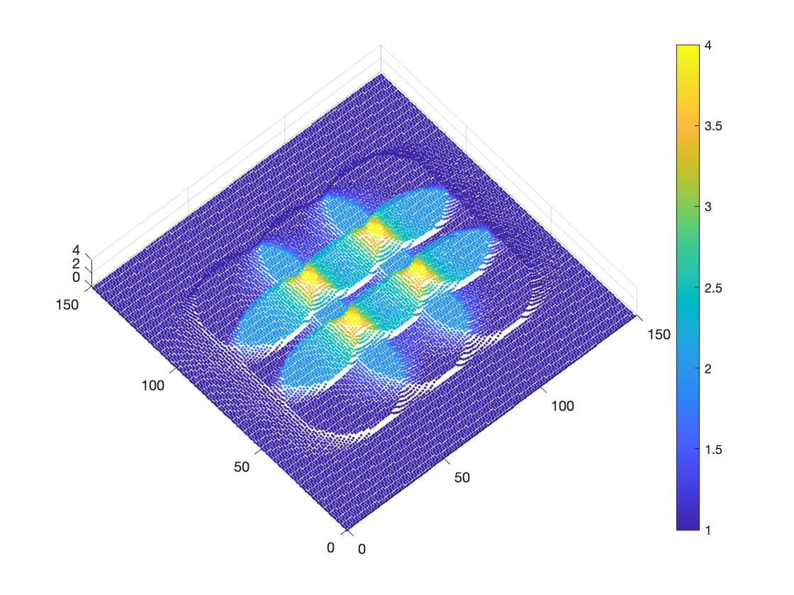

## Montage-Tomography-Simulation
Simulation of tilt series collection and dose accumulation over the region on interest interacting with e-beam. 

### Plotting dose accumulation in 3D

Download the function file `Plotting3D.m` and place in the same directory where MATLAB desktop or online is launched.
In the MATLAB command window, you could type `help Plotting3D` to know the input parameters.

```
help Plotting3D
Plotting3D(T,tiltsD,size,max) plots voxel positions x-y and z as the
  normalized dose against non-offsets collection in 3D.
  The color of each point corresponds to the value of the normalized dose.
 
  INPUT T is the csv file name.
 
  INPUT tiltsD is the approximate mean of the total dose of a regular tilt
  series with 1 e/A per tilt. e.g. 60 to -60, 3 degree increment, tiltsD =
  41, if 2 degree increment, tiltsD = 61.
 
  INPUT size(optional) defines the size of the scattering points,defautl as
  2.
 
  INPUT max(optional) defines the maximum number on the legend z-axis.
```
After exporting the csv file (default: simulation.csv) from TomoGrapher placed in the same directory, an example command for plotting:

```
Plotting3D('simmulation.csv',41,5,4)
```
An example output is: 

