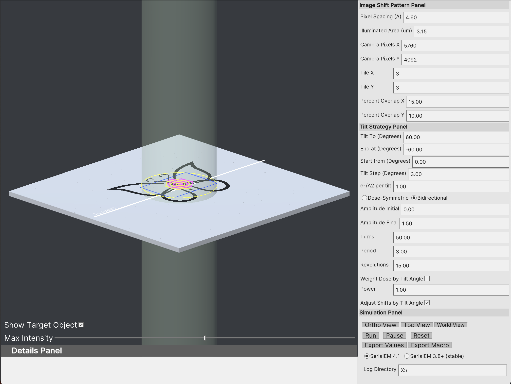
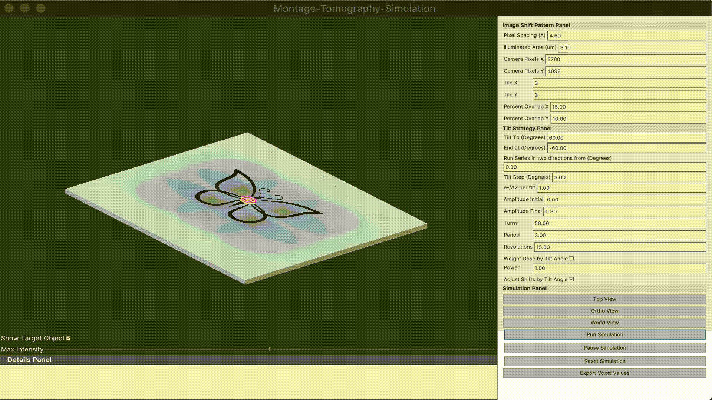
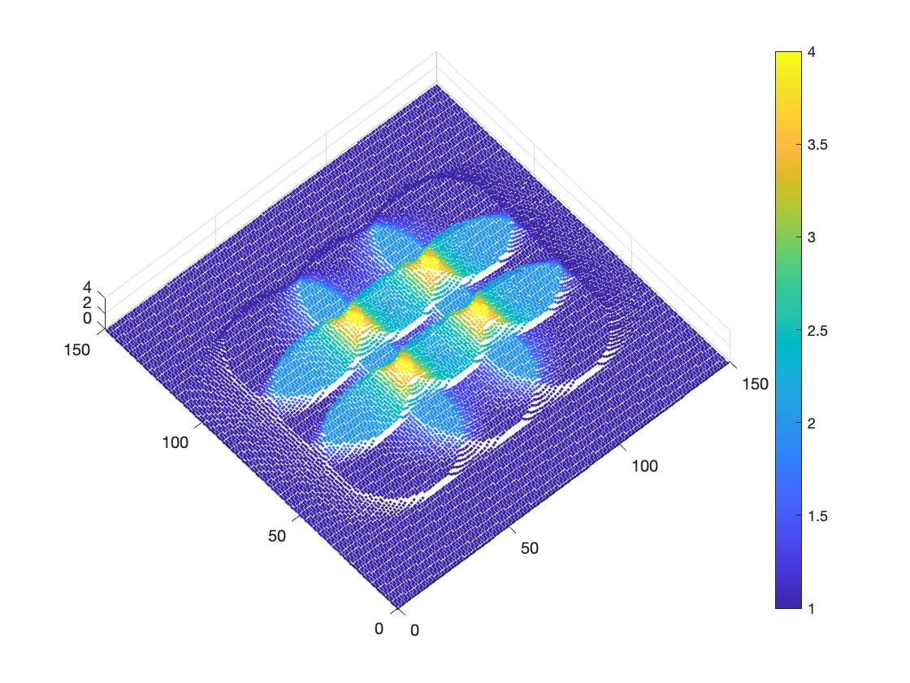

## Montage-Tomography-Simulation
TomoGrapher is a standalone application that can simulate a tilt series collection and dose accumulation, with many interactive parameters.

See the GitHub releases section for a prebuilt executables for Windows and Mac.

New! See the [Tomographer Tutorial](TomoGrapher_Tutorial.md)

The main window (shown below) provides a 3D view of the beam and stage.



The **Image Shift Pattern Panel** provides parameters to change the Pixel Spacing, Illuminated Area (beam diameter), Camera Pixels X/Y describing the size of the camera area, Tile X/Y describing how many image shifts in X/Y, and the Percent Overlap of neighboring image areas.

The **Tilt Strategy Panel** provides parameters describing the tilt series. This includes the tilt range, tilt step, and starting tilt. Additionally, there are a series of parameters describing a strategy of shifting of the image shift pattern at each tilt angle. Visually, the parameters Amplitude initial/final, Turns, Period, and Revolutions affect the two spirals. Larger spirals will better describe the electron dose on the target.

The **Simulation Panel** contains controls to change the camera views, run a simulation, pause/restart, and to export data values. The exported data values can be used externally with a Matlab function described below to generate figures and plots of dose.

Run the simulation to see an animated series:



### Plotting dose accumulation in 3D

Download the function file [`Plotting3D.m`](docs/Plotting3D.m) and place in the same directory where MATLAB desktop or online is launched.
In the MATLAB command window, you could type `help Plotting3D` to know the input parameters.

```
help Plotting3D
Plotting3D(T,tiltsD,size,max) plots voxel positions x-y and z as the
  normalized dose against non-offsets collection in 3D.
  The color of each point corresponds to the value of the normalized dose.
 
  INPUT T is the csv file name.
 
  INPUT tiltsD is the approximate mean of the total dose of a regular tilt
  series with 1 e/A per tilt. e.g. 60 to -60, 3 degree increment, tiltsD =
  41, if 2 degree increment, tiltsD = 61.
 
  INPUT size(optional) defines the size of the scattering points,defautl as
  2.
 
  INPUT max(optional) defines the maximum number on the legend z-axis.
```
After exporting the csv file (default: simulation.csv) from TomoGrapher placed in the same directory, an example command for plotting:

```
Plotting3D('simmulation.csv',41,5,4)
```
An example output (3x3 tile montage, no translational offset, 41 tilts with 1 e/A^2/tilt) is: 

