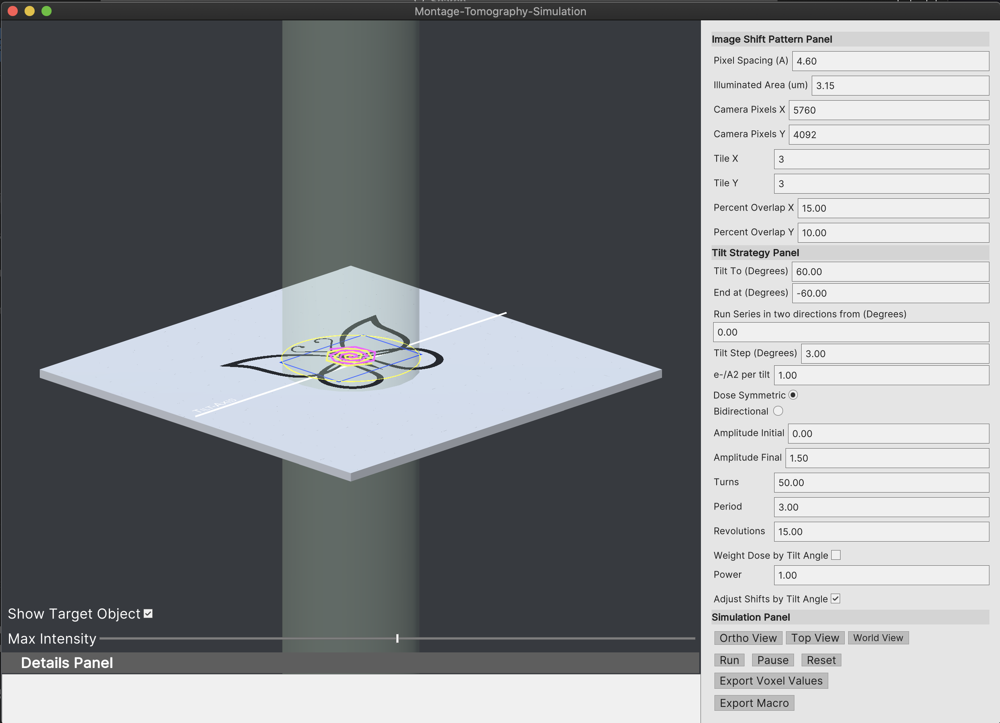

# TomoGrapher Tutorial

Start TomoGrapher by launching the executable on either Windows or Mac.  You are given a view with 3 different panes including a view of a Cryo-ET stage, a column on the right side, and an information panel at the bottom.

In this tutorial, you will setup a 2x2 montage and simulate the dose exposures on a virtual stage.

The pattern shown on the stage, a butterfly, represents a sample to be imaged by a montage collection.  In order to completely collect the entire sample field of view at the current pixel spacing, multiple imaging shifts will tile a set of overlapping images to cover the sample view.

## Image Shift Patterns

First, take a look at the **Image Shift Pattern Panel**. The parameters in this panel provide controls configure the pixel spacing and the absolute illuminated area of the beam.  The camera dimensions in pixels by default match that of the Gatan K3, but can be changed to match a specific camera.  

Other items `Tile X` and `Tile Y` will determine the overall montage pattern that will be produced.  A 3x3 montage is the default, but this can be changed to an arbitrary number of X and Y tiles that will be imaged with beam shifts.  

Montage stitching requires overlaps of neighboring tiles, and the percent of the overlap can be set by the `Percent Overlap X` and `Percent Overlap Y`.

## Tilt Strategy

You will next setup the overall tilt series range in the panel of `Tilt Strategy`.

## Start the Simulation

Last, take a look at the  **Simulation Panel** at the bottom section of the control panel.  

Three buttons allow you to change the camera view: `Ortho View`, `Top View`, and `World View`.  The `Ortho View` is locked at a 45 degree orthogonal perspective view of the sample stage.  The `Top View` positions a camera above to face directly at the stage.  The `World View` keeps a camera locked in an original position, allowing you to view the tilting of the stage.

## Export dose information

## Export a SerialEM macro

