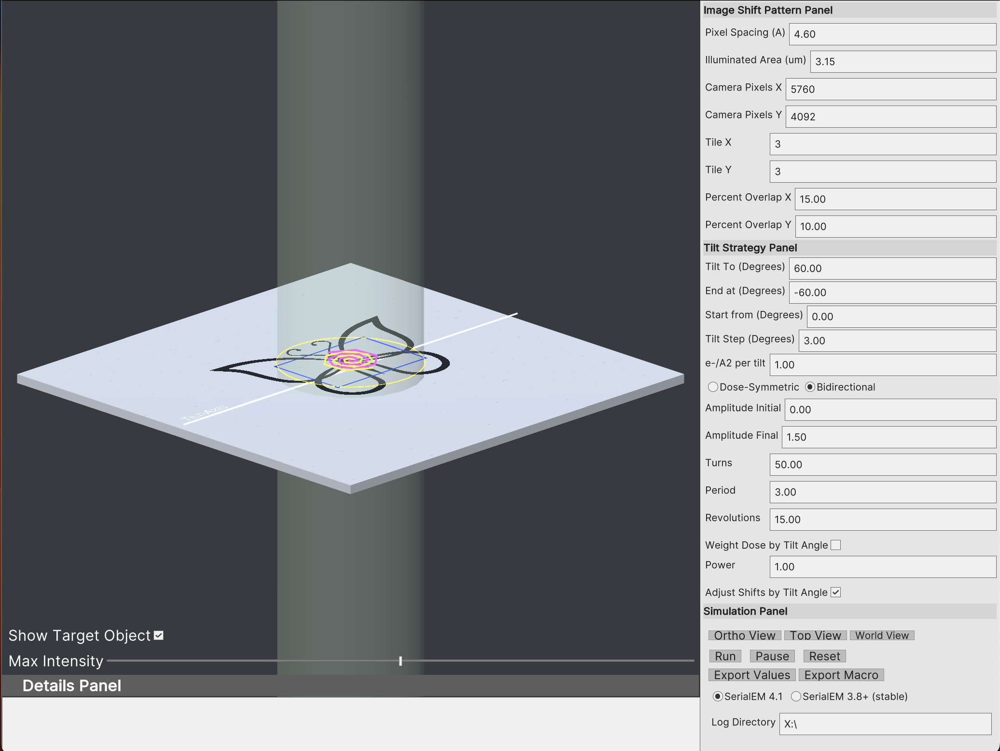
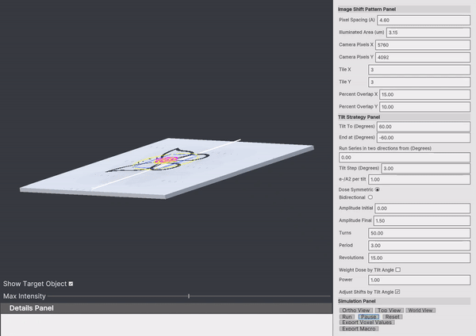
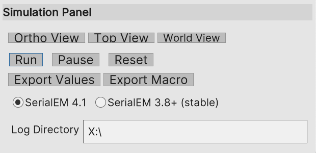

# TomoGrapher Tutorial
```
Updated 2022/9/13
```

Start TomoGrapher by launching the executable on either Windows or Mac.  

Your window shows 3 different panes including a view of a sample on a virtual stage, an options column on the right side, and an information panel at the bottom.



In this tutorial, you will setup a 3x3 montage and simulate the dose exposures on a virtual stage.

The pattern shown on the stage, a butterfly, represents a sample to be imaged by a montage collection.  In order to completely collect the entire sample field of view at the current pixel spacing, multiple imaging shifts will tile a set of overlapping images to cover the sample view.

## Image Shift Patterns

First, take a look at the **Image Shift Pattern Panel**. The parameters in this panel provide controls configure the pixel spacing and the absolute illuminated area of the beam.  The camera dimensions in pixels by default match that of the Gatan K3, but can be changed to match a specific camera.  


First, try changing the `illumated area` to see how different beam sizes would impact on the sample.

Next, try changing the camera dimension from 5760x4092 (Gatan K3 dimension) to 4092x4092 (Falcon 3 or Falcon 4 dimensions). You will see the camera preview box will adapt with your changes:


Other items `Tile X` and `Tile Y` will determine the overall montage pattern that will be produced.  The 3x3 montage is the default, but this can be changed to an arbitrary number of X and Y tiles that will be imaged with beam shifts.  

Montage stitching requires overlaps of neighboring tiles, and the percent of the overlap can be set by the `Percent Overlap X` and `Percent Overlap Y`.

## Simulation Panel

Take a look at the  **Simulation Panel** at the bottom section of the control panel.  

Three buttons allow you to change the camera view: `Ortho View`, `Top View`, and `World View`.  The `Ortho View` is locked at a 45 degree orthogonal perspective view of the sample stage.  The `Top View` positions a camera above to face directly at the stage.  The `World View` keeps a camera locked in an original position, allowing you to view the tilting of the stage.



This panel also features controls to start a simulation with the button `Run`, as well as to `Pause` and `Reset` the simulation to no exposures.

Try running the simulation now.


After running the simulation, switch to the top view and hover over the center point of the simulation.  You will see a measurement of the electron dose at the intersecting voxel of your virtual sample shown in the `Details Panel` (bottom).


## Tilt Strategy

You will next setup the overall tilt series range in the **Tilt Strategy** panel.


Changing the `Tilt To` and `End At` correspond to the extreme tilt ranges of your collection.  The `Tilt Step` sets the increment between subsequent tilt steps.

Try changing these to setup a tilt series from -50 to 50 degrees in 2 degree increments.


Next, change to the `Top View` if not using that camera angle. Notice the spiral pattern shown in the center.  This is a representation of the how a center point of an image shift pattern (3x3 montage) will translate as the tilt-angle changes. Parameters that control this pattern are the Amplitude Initial, Amplitude Final, Turns, Period, and Revolutions.  

Run a simulation as-as and the pattern will look like this:


Next, if you change the `Amplitude Final` to be a smaller you will be reducing the translation between shifts.  Set this value to `Amplitude Final` as 0 to completely disable translational shifts in the pattern and run it again.


Now, without the translation shifts of the pattern between tilt steps, the overlapping dose is a higher intensity.  

Parameters for the SerialEM can be optimized for best translational shifts to reduce and distribute the dose occuring at the overlapping edges.

## Export dose information
After the tilt-series simulation completes, you can export the total dose values for each of the voxel positions of the stage.  These values can be used for graphing in MatLab and other analysis software.


## Export a SerialEM macro

Finally, to carry over the values tested in the simulation for conducting a tilt-series collection in SerialEM, you can export a Macro file.  The macro will be set with the parameters describing the tilt-strategy to run with the collection in SerialEM.

TomoGrapher is able to export Macro files compatible with either the current stable SerialEM 3.8+ versions, or newer SerialEM 4.1+ developmental versions.  The GUI offers a selector to choose which is appropriate.  Additionally, it is recommended to fill in a path to where logging and descriptive files can be written by SerialEM during the macro execution.



Press the `Export Macro` button and choose a filename to save the macro for SerialEM containing values from the simulation.


