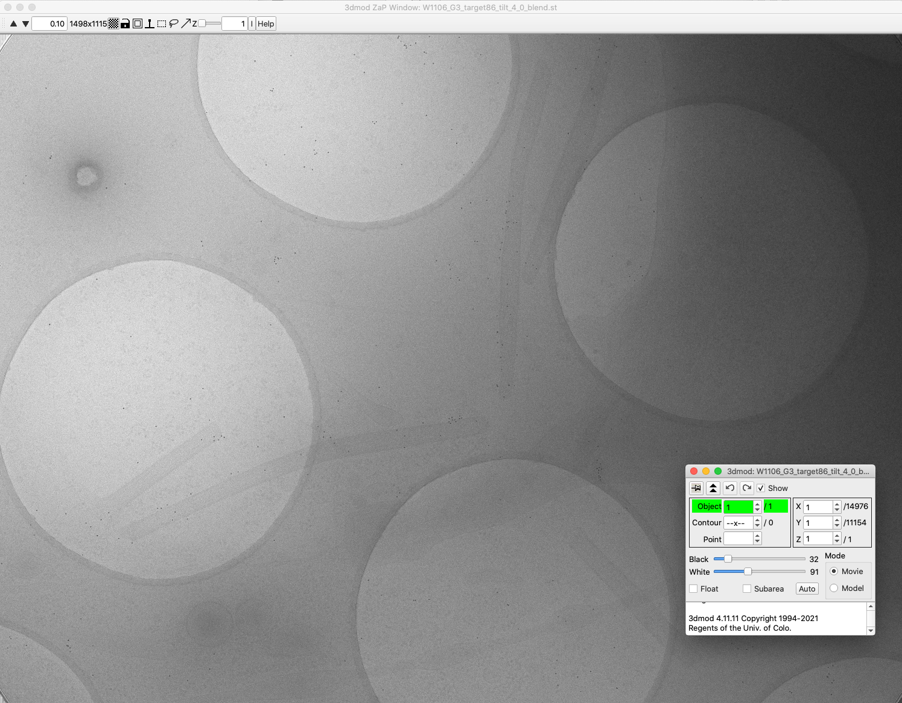
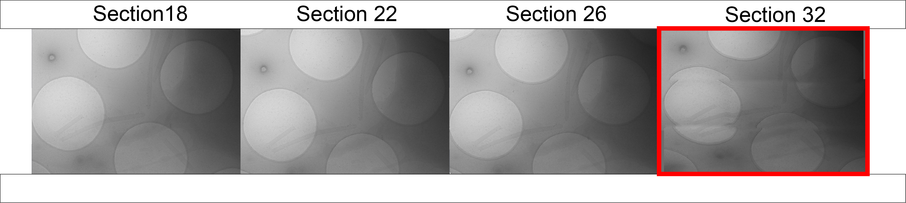

## Tutorial for Montage Generation

### Introduction
The starting point for montage tomography is a data collection in SerialEM. The Github provides instructions for setting up your own SerialEM montage collections with a macro ([see instructions here for SerialEM](../SerialEM/README.md)). 

This tutorial provides a starting dataset from a 3x3 tiled montage collected on a 300-kV Titan Krios cryo-TEM on a Gatan K3 direct electron detector. Overall the data collection parameters for the collection are below:

```
Imaging mode = EFTEM
Imaging probe = NanoProbe
Spot size = 8
C2 Aperture = 100
C2 Lens Power = 42.42
Illuminated area = 3.15
Objective aperture = 0
Energy filter slit width (eV) = 20
Acceleration voltage = 300
Using Phase Plate? = No

Type of camera = Gatan K3
Camera mode = Counting
Using CDS = Yes
Pixel size (Å) (unbinned) = 4.603
Dose per tilt (e-/ Å2) = 1.86
Total dose (e-/ Å2) = 70
Exposure time per tilt (sec) = 1.1
Dose rate (e-/pixel/sec) = 12

Motion-correction processing = MotionCor2
Tilt Scheme: Dose-symmetric
Tilt Angle (degrees): 3
Tilt Range (degrees): -51 to 51
Tilt Group (degrees): 3
```

The starting dataset includes a full tilt-series that can now be processed to build a montage for each tilt and an overall tomogram.

### Requirements
1. These instructions require a Linux environment with Python3, and IMOD installed.
2. IMOD programs should be in the PATH including `blendmont`, `newstack`, and `etomo`.
3. 100 GiB free disk space (data for the tilt series is 28 GiB, additional storage is required for results from the processing workflow).


### Get the starting material

Download the latest release `scripts.zip` from the [GitHub releases](https://github.com/wright-cemrc-projects/cryoet-montage/releases), unzip this to get a folder with several python scripts:

```
% cd ~/Downloads
% unzip scripts.zip
% ls scripts/Python 
BlendStitch.py		README.pdf
MotionCorrect.py	SplitTomogram.py
% ls scripts/SerialEM 
README.pdf	cryoMontage.txt
```

The scripts.zip contains both a SerialEM macro `cryoMontage.txt` that can be used in the data collection for the montage tomography. This tutorial skips the SerialEM collection ([see instructions here for SerialEM]()).

Begin by downloading the `W1106_G3_target86_tilt4_dataset.tar` from the cloud-hosted storage : [Download Link](https://cemrcstatic.blob.core.windows.net/cryoet-montage/W1106_G3_target86_tilt_4_dataset.tar)

Open a terminal, and change to the directory of your downloaded archive, then expand the contents of the tarball:

```
% cd ~/Downloads
% ls *.tar
W1106_G3_target86_tilt_4_dataset.tar
% tar -xvf W1106_G3_target86_tilt_4_dataset.tar
```

### Creating montage tilt stacks

The sample data is a 3x3 tiled montage images of a tilt-series taken on a Titan Krios with a Gatan K3 direct electron detector recorded in CDS mode as unbinned movies of 5760 x 4092 resolution. Each of the tiles overlaps with the neighbor tiles covering 20% on the X-axis (1152 pixels) and 15% on the Y-axis (576 pixels).

> A helper motion correction script has also been provided for bulk motion correction steps starting from a SerialEM data collection [Using MotionCorrect.py](https://github.com/wright-cemrc-projects/cryoet-montage/blob/main/Python/README.md)).

The demo data already has motion correction steps completed.

The next step organizes all images collected at a particular tilt into a separate subdirectory in an output folder. A `piecefile` is generated to provide information to IMOD's `blendmont` command exactly specifying how the images should be arranged in tiles. After repeating this process for each individual tilt step, the montage images are assembled as a stack for further processing and tomogram generation.

Change to the directory containing the expanded `W1106_G3_target86_tilt_4_dataset` and now you can run the script `BlendStitch.py` from its location:

```
~/BlendStitch.py --input W1106_G3_target86_tilt_4_dataset --output W1106_G3_target86_tilt_4_dataset_out --starting_angle -51 --tilt_increment 3 --ending_angle 51 --overlap_x 1152 --overlap_y 576 --camera_x 5760 --camera_y 4092 --basename W1106_G3_target86_tilt_4
```

This run takes approximately 15 minutes on a 3.0 Ghz Xeon processor.

Let's take a look at the output:

```
$ ls W1106_G3_target86_tilt_4_dataset_out/
tiltList.txt                           W1106_G3_target86_tilt_4AliSB_bin4.st
tilt.rawtlt                            W1106_G3_target86_tilt_4AliSB.st
W1106_G3_target86_tilt_4AliSB_bin2.st  W1106_G3_target86_tilt_4_Processing
```

Looking inside the `W1106_G3_target86_tilt_4_Processing` folder shows each of the organized Tilt directories and blended images for the tiles of that tilt increment:

```
$ ls W1106_G3_target86_tilt_4_dataset_out/W1106_G3_target86_tilt_4_Processing/
Tilt_0    W1106_G3_target86_tilt_4_0_blend.st
Tilt_12   W1106_G3_target86_tilt_4_-12_blend.st
...
```

Open the generated 0 degree tilt montage image with IMOD:

```
imod W1106_G3_target86_tilt_4_dataset_out/W1106_G3_target86_tilt_4_Processing/Tilt_0/W1106_G3_target86_tilt_4_0_blend.st
```

The image is the montaged result of 9 tiles seamlessly joined to create an overall 14976 x 11154 dimension image:



The overall product is a stack called `W1106_G3_target86_tilt_4AliSB.st` containing 35 montage image frames for the tilt series. Bin 2 and bin 4 reduced files are also produced as `W1106_G3_target86_tilt_4AliSB_bin2.st` and `W1106_G3_target86_tilt_4AliSB_bin4.st` and can be used for initial processing and review.

> One of the advantages of this data collection organization is the ability to use stacks of individual tiles instead of the montage. The GitHub site also contains the script `SplitTomogram.py` that can separate each of the tiles of the 3x3 montage as it's own stack for processing and comparisons.

Let's take a look at bin4 stack generated for the initial checks of stitching in each tilt step `W1106_G3_target86_tilt_4AliSB_bin4.st`:

```
imod W1106_G3_target86_tilt_4AliSB_bin4.st
```

This tilt stack has 35 sections.

In this particular example, when you iterate through the sections, you can see that the 6-30 (+/- 36 degree range) appear quite well stitched. And as you increment the fractions in the **3dmod ZaP Window** you can see a small translational shift between each fraction. This shift is described in the ([see instructions for SerialEM](../SerialEM/README.md)) from the collection spiral collection scheme used to reduce the acculation of electron dose at overlaps between the image tiles over the tilt-series.



The last image panel, for the section 32 of the stack begins to show issues with the stitching. The next section describes how you can now improve the stitching on individual tilts manually in Etomo with Midas, and proceed to generate a tomogram.

### Post-processing the montage tilt stacks with Etomo/Midas


